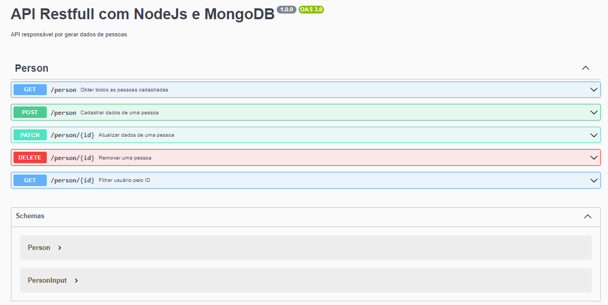

# Projeto API Restfull com NodeJs e MongoDB

## Objetivo

- Construir uma API utilizando NodeJs e Express fazendo a mesma integrar-se com um banco de dados NoSQL;
- Fazer a documentação utilizando o Swagger. 

<br>

## Índice 📜

#### Screenshot

#### Requisitos do Projeto

#### O Projeto

#### Funcionalidades

#### Tecnologias Usadas

#### Como rodar o projeto

<br>

## Screenshot 🎬

<div align='center'>

</div>

<br>

## Requisitos funcionais do Projeto 🧾

- Listar os dados das pessoas cadastradas no banco;
- Cadastrar uma pessoa no banco;
- Atualizar dados de uma pessoa no banco;
- Remover os dados de uma pessoa no banco;
- Filtrar os dados de uma única pessoa pelo ID.

<br>

## O Projeto 📚

Este projeto é um backend construído em NodeJs, Express e a biblioteca Mongoose. Ele se integra ao banco de dados MongoDB disponível online. Por isso, para as operações com o banco foi utilizado a biblioteca Mongoose. 

<br>

## Funcionalidades ⚙

- Cadastro de uma pessoa;
- Listagem dos registros do banco;
- Listagem dos registros de maneira individualizada pelo ID;
- Atualização dos registros pelo ID;
- Deleção dos registros pelo ID.

<br>

## Tecnologias Usadas 🛠

- NodeJs;
- Express;
- MongoDB;
- Mongoose;
- Swagger.

<br>

## Como rodar o projeto 🎮

Clone o repositório
```bash
git clone https://github.com/ederhscc/project-api-restfull-nodejs-e-mongobd
```

 Acesse a pasta do projeto
```bash
cd project-api-restfull-nodejs-e-mongobd
```

Instalar as dependências
```bash
npm install
```

Execute a aplicação
```bash
npm start
```

<br>

## Autor 🧑

### Eder Henrique Santos

<br>

## Links 🔗

Deploy: 

<div align="left">

  <a href = "mailto:ederhscc@gmail.com" target="_blank">
  
  </a>
  </br>
  <a href="https://www.linkedin.com/in/eder-henrique-santos" target="_blank">
  
  </a>
  </br>

</div>